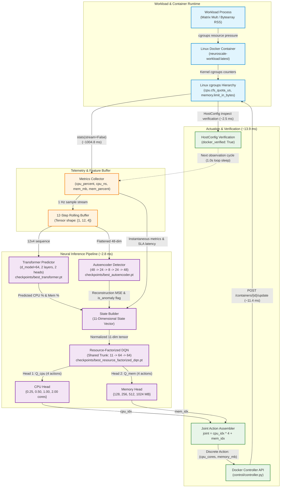

# NeuroScale: End-to-End System Architecture

**Project**: NeuroScale: Dynamic Autonomous Vertical Pod Autoscaler  
**Architecture Specification**: Real-Time Autonomous Closed Loop  

---

## 1. Closed-Loop Architecture Flowchart

---

## 2. Core Architectural Subsystems

### 1. Telemetry & Perception Layer
- **Collector (`control/collector.py`)**: Interfaces with `docker-py`'s `container.stats(stream=False)`. Extracts physical utilization:
  - `cpu_percent`: Instantaneous percentage utilization across host cores.
  - `cpu_usage_ns`: Linux kernel cumulative CPU nanoseconds.
  - `memory_usage_mb`: Active RSS memory in megabytes.
  - `memory_percent`: Current usage as a fraction of container limit.
- **Rolling Window Buffer**: Maintains a FIFO queue of 12 sequential 4-dimensional observations:
  $$\mathbf{X}_{\text{window}} \in \mathbb{R}^{12 \times 4}$$

### 2. Neural Perception & Forecasting Pipeline
- **Transformer Predictor (`models/predictor.py`)**:
  - Architecture: Multi-head self-attention sequence model ($d_{\text{model}}=64$, 2 heads, 2 encoder layers).
  - Checkpoint: `checkpoints/best_transformer.pt` (Val MSE: $0.004258$).
  - Outputs: Predicted next CPU utilization ($\%$) and Memory demand ($\%$) with confidence scalar.
- **Autoencoder Anomaly Detector (`anomaly/detector.py`)**:
  - Architecture: Fully connected bottleneck ($48 \to 24 \to 8 \to 24 \to 48$).
  - Checkpoint: `checkpoints/best_autoencoder.pt` (Threshold: $0.003814$).
  - Outputs: Reconstruction mean squared error (MSE) and boolean `is_anomaly` flag.

### 3. State Construction & Representation
- **StateBuilder (`models/state.py`)**:
  Constructs a dense, normalized 11-dimensional state vector $\mathbf{s} \in [0, 1]^{11}$:
  1. `current_cpu_util`: Instantaneous CPU fraction.
  2. `current_mem_util`: Instantaneous memory fraction.
  3. `predicted_cpu_demand`: Transformer next-horizon CPU estimate.
  4. `predicted_mem_demand`: Transformer next-horizon memory estimate.
  5. `prediction_confidence`: Transformer uncertainty metric.
  6. `is_anomaly`: Autoencoder boolean threshold flag ($0.0$ or $1.0$).
  7. `anomaly_score`: Normalized reconstruction loss.
  8. `sla_latency_norm`: Current measured latency relative to SLA.
  9. `sla_violation`: Boolean indicator ($1.0$ if latency $> 200\text{ ms}$).
  10. `host_cpu_headroom`: Remaining physical host core availability.
  11. `host_mem_headroom`: Remaining physical host RAM availability.

### 4. Decision & Factorized RL Layer
- **Resource-Factorized DQN (`rl/resource_factorized_dqn.py`)**:
  - Shared Feature Trunk: Linear($11 \to 64$) $\to$ ReLU $\to$ Linear($64 \to 64$) $\to$ ReLU.
  - CPU Q-Head: Linear($64 \to 4$) evaluating discrete CPU core actions: $\{0.25, 0.50, 1.00, 2.00\}\text{ cores}$.
  - Memory Q-Head: Linear($64 \to 4$) evaluating discrete memory actions: $\{128, 256, 512, 1024\}\text{ MB}$.
  - Joint Action Reconstruction:
    $$joint\_action = cpu\_idx \times 4 + mem\_idx \in \{0, 1, \dots, 15\}$$
  - Checkpoint: `checkpoints/best_resource_factorized_dqn.pt`.

### 5. Actuation & OS Verification Layer
- **Docker Controller (`control/controller.py`)**:
  - Translates discrete action into Linux cgroup configuration:
    $$\text{CpuQuota} = \text{int}(\text{cpu\_cores} \times 100,000), \quad \text{Memory} = \text{int}(\text{mem\_mb} \times 1024^2)$$
  - Submits update to Docker Engine API: `POST /containers/{container_id}/update`.
- **Verification Engine**:
  - Executes immediate `container.reload()` and inspects `attrs["HostConfig"]`.
  - Confirms before and after values match requested allocations.
